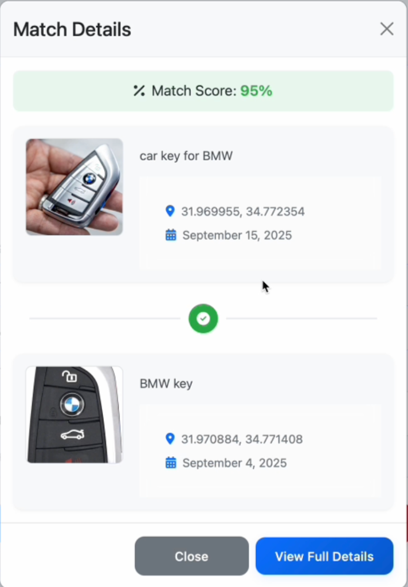
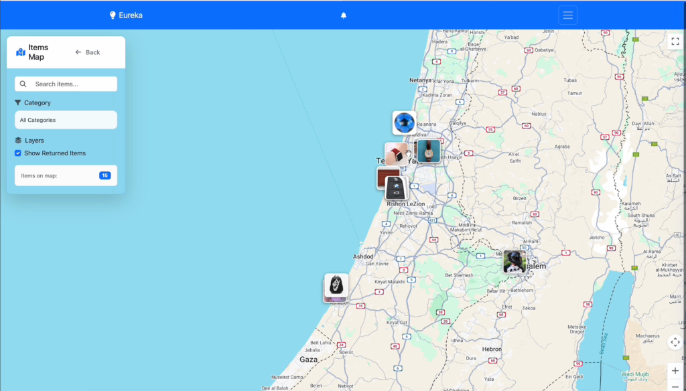
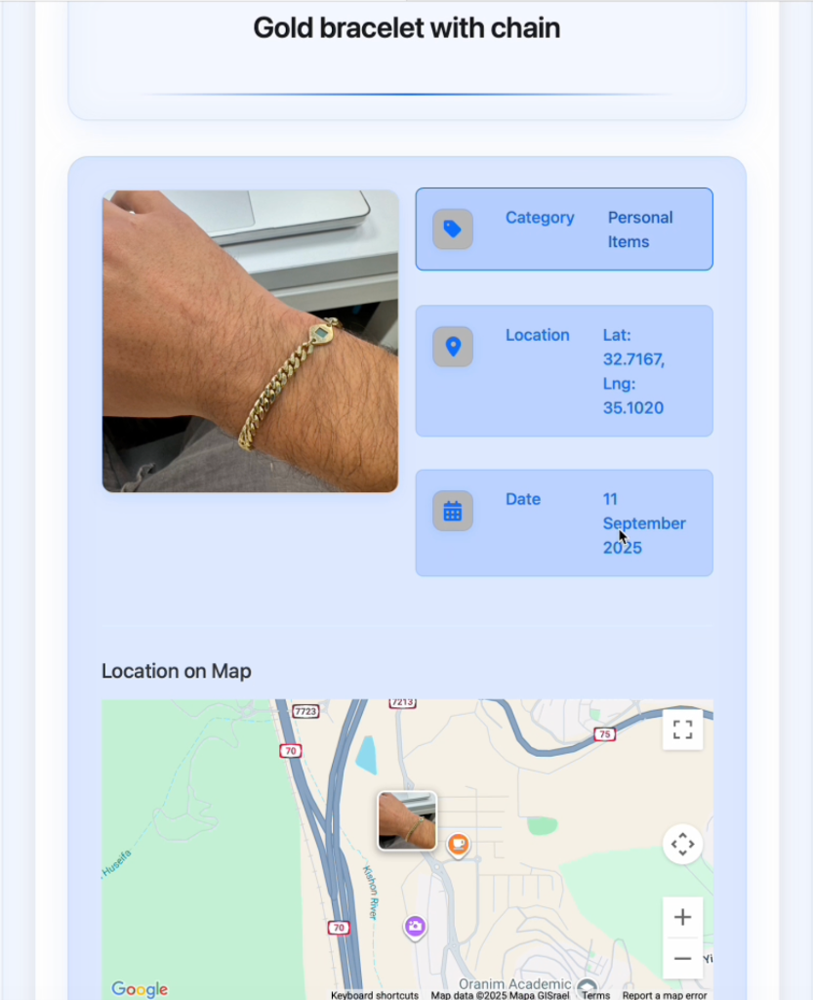
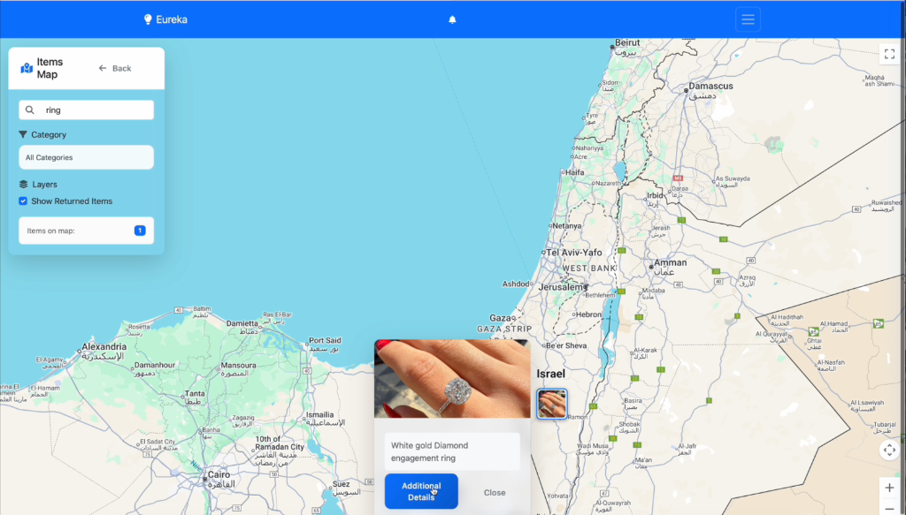
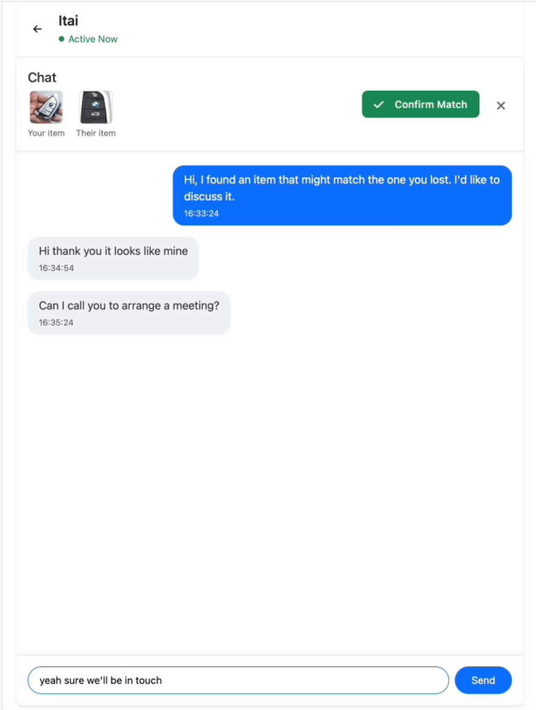

# 💡 EUREKA! - AI-Powered Lost & Found Platform

**Eureka** is a smart, AI-driven platform designed to help people reconnect with their lost belongings. By leveraging advanced image recognition, geolocation services, and intelligent matching algorithms, Eureka takes the hassle out of finding lost items.

## ✨ Key Features

*   **🔍 AI Image Matching**: Powered by **Google Cloud Vision API** and **OpenCV**, Eureka analyzes images to detect objects, colors, and unique features.
*   **🧠 Smart Matching Algorithm**: Automatically compares lost and found items to identify matches with a high degree of accuracy (e.g., matching a "BMW key" found at a specific location with a reported lost item).
*   **🗺️ Interactive Map**: visualize reported items on a dynamic map, filter by category, and search for specific items (e.g., "ring").
*   **💬 Secure Chat System**: Connect directly with other users to verify ownership and arrange for the return of items.
*   **🔔 Real-time Notifications**: key alerts when potential matches are found.

## 📸 Screenshots

| Match Details & Scoring | Interactive Map View |
|:---:|:---:|
|  |  |
| **High confidence matching score (95%)** | **Browse items geographically** |

| Item Details | Map Search |
|:---:|:---:|
|  |  |
| **Rich item descriptions & location** | **Powerful search capabilities** |

| Secure Chat |
|:---:|
|  |
| **Coordinate returns safely** |

## 🛠️ Tech Stack

### Frontend
*   **React** (TypeScript)
*   **Vite** - Build tool
*   **TailwindCSS** & **Bootstrap** - Styling
*   **React-Leaflet** - Maps integration
*   **Socket.io-client** - Real-time communication

### Backend
*   **Node.js** & **Express**
*   **MongoDB** & **Mongoose** - Database
*   **Google Cloud Vision API** - Image analysis
*   **OpenCV.js** - Image comparison
*   **Socket.io** - WebSockets

## 🚀 Getting Started

### Prerequisites
*   Node.js (v18+)
*   MongoDB installed and running
*   Google Cloud Vision API Key

### Installation

The project is divided into `Frontend` and `Backend`.

#### 1. Backend Setup
```bash
cd Backend
npm install
# Create .env file with your credentials (see Backend/README.md)
npm run dev
```

#### 2. Frontend Setup
```bash
cd Frontend
npm install
npm run dev
```

